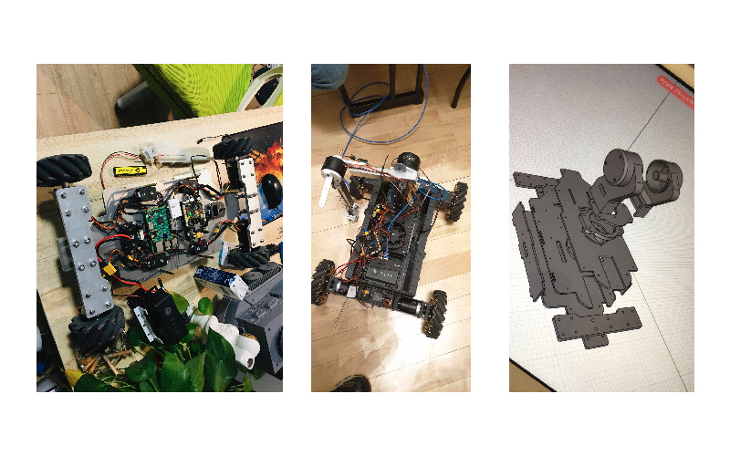

# RoboMentors_Board

RoboMentors_Board是一款面向机器人DIY的开源主控开发板。  
芯片为STM32F427IIH6，拥有丰富的扩展接口和通信接口，板载IMU传感器。  
兼容Dji RoboMaster的M3508、 M2006、GM6020直流无刷减速电机以及遥控器。   
支持Jetson Nano、树莓派、妙算等产品的串口通讯。

## 硬件模块购买地址

RoboMentors开发板套件：[即将发售]

RoboMaster开发板套件：[点击购买](https://www.robomaster.com/zh-CN/products/components/general/development-board)

GM6020云台电机：[点击购买，需要2个](https://www.robomaster.com/zh-CN/products/components/general/gm6020/info)

M3508减速直流电机：[点击购买，需要4个](https://www.robomaster.com/zh-CN/products/components/general/M3508)

C620无刷电机调速器：[点击购买，需要4个](https://www.robomaster.com/zh-CN/products/components/general/M3508)

RoboMaster遥控器：[点击购买](https://www.robomaster.com/zh-CN/products/components/detail/122)

RoboMaster中心板：[点击购买](https://www.robomaster.com/zh-CN/products/components/detail/143)

RoboMaster TB47D电池：[自行淘宝]

RoboMaster TB47D电池架：[自行淘宝]

> 如上述硬件模块无法购买，请自行淘宝。

## 工程文件说明

代码基于Dji RoboMaster A型开发板示例例程整理，友好的帮助机器人爱好者轻松入门。

作者微信：superzz8080

开发工具：Keil 5

配套教学视频课程：[bilibili](https://www.bilibili.com/video/av66802974?p=1) 或者 [慕课网](https://www.icourse163.org/course/preview/HIT-1003471013/?tid=1003700014) 

## 工程文件使用说明

step1：使用Keil 5打开工程文件Project -> RoboMentors_Board.uvprojx

step2：在Keil 5左侧的项目结构中找到RoboMentors_Board -> app -> study_task.c文件，并打开

step3：你会看到所有已经实现的实验项目，根据自己需求去掉相应的注释即可

## 已实现功能清单

> GPIO灯效控制

> PWM控制 三色灯

> PWM控制 舵机的控制

> PWM控制 蜂鸣器

> 串口通讯 数据的接收

> 串口通讯 数据的发送

> 串口通讯 CAN数据发送与接收

> 传感器 光电传感器

> 传感器 板载IMU传感器

> 传感器 霍尔传感器&磁传感器

> 执行器 舵机的控制

> 执行器 舵机速度的控制

> 执行器 电机的控制

> 执行器 电机正转、反转、加速、减速的控制

> 控制技术 PID运算方法

> 使用遥控器控制灯效

> 使用遥控器控制灯效、电机

> 使用遥控器控制底盘的前进后退左转右转

> 使用遥控器控制底盘的前进后退左转右转，加入PID算法

> 使用遥控器控制底盘的前进、后退、左转、右转、左平移、右平移，加入PID算法

## 待实现功能清单

> 使用遥控器控制云台

## 特别鸣谢

Dji RoboMaster

哈理工（旋风战士）